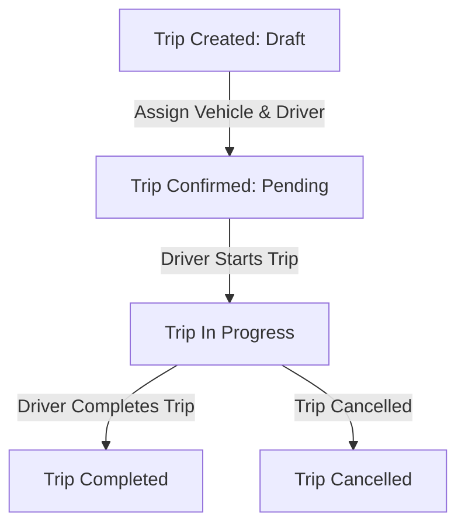

# TransitOps ⚡
> Smart Transport Operations Platform built on Frappe Framework (v16) & Vue.js 3

TransitOps is a modern, responsive, and upgrade-safe logistics and fleet operations platform. It integrates a secure, performant Frappe backend with a rich Vue 3 Single Page Application (SPA) dashboard.

---

## 🏗️ Architecture Overview

The application follows a decoupled modern layout:
1. **Frappe Backend (App: `transitops`)**:
   - Manages core relational databases, schema migrations, hooks, permissions, workflows, server-side validation, scheduled jobs, and custom whitelisted JSON APIs.
   - Provides native **Desk Workspaces**, **Number Cards**, and **Dashboard Charts** for operational analysts.
2. **Frontend Vue.js SPA (`frontend/`)**:
   - Built with **Vue 3**, **Vite**, and **Vue Router**.
   - Fully styled using native custom CSS for a state-of-the-art dark-mode dashboard.
   - Integrated with standard Frappe auth and CSRF security, running seamlessly with hot-reloading using a Vite development proxy.

---

## 🗃️ DocTypes & Data Model

The platform defines 7 core custom DocTypes:
* **Vehicle**: Tracks name, license plate, status (Active, Maintenance, Out of Service), make, model, year, fuel type, odometer, and document expiration dates (registration, insurance).
* **Driver**: Manages driver profiles, license number, status (Active, Suspended, Inactive), contact information, and license expiry dates.
* **Trip**: The core operational document tracking vehicle, driver, source, destination, status (Draft, Pending, In Progress, Completed, Cancelled), start/end times, and odometers.
* **Maintenance Log**: Manages vehicle maintenance events, scheduling dates, type, cost, and completion status.
* **Fuel Log**: Logs refuels, fuel quantity (liters/gallons), cost per unit, and fuel cost tracking.
* **Expense**: Categorizes and captures other operational expenses (tolls, permits, cleaning).
* **TransitOps Settings**: Configures platform-wide compliance limits, currency, and parameters.

---

## 🔄 Business & Data Flows

### 1. Trip Lifecycle & Dispatch

- **Validation**: Trips cannot be started if the driver or vehicle is already assigned to another active trip, or if the driver's license/vehicle registration has expired.
- **Odometer Sync**: Completing a trip automatically updates the current odometer reading of the assigned Vehicle.

### 2. Maintenance & Compliance
- **Scheduled Jobs**: A daily background cron job scans all Vehicles and Drivers, checking registration, insurance, and license expiration dates.
- **Alerts**: Email notifications and reminders are automatically sent out for documents expiring within the buffer period configured in **TransitOps Settings**.

### 3. Cost & Performance Metrics
- **Fuel Efficiency**: System computes Kmpl / Mpg metrics dynamically.
- **Realtime Dashboard**: Computes total active trips, pending tasks, total maintenance cost, and fuel efficiency trends.

---

## 💻 Developer Setup & Workflow

### 1. Prerequisites
Ensure you have the following installed:
- Node.js (v18+)
- Python 3.10+
- Bench CLI (Frappe v16 environment)

### 2. Installation
To install the app on a Frappe site (e.g. `transitops.local`):
```bash
# Add the app to the bench
bench get-app transitops

# Install the app on your site
bench --site transitops.local install-app transitops

# Run DB seed scripts to populate mock Vehicles, Drivers, Trips, etc.
bench --site transitops.local execute transitops.seed_data.seed

# Set up standard Workspace, Number Cards, and Dashboard Charts in Desk
bench --site transitops.local execute transitops.dashboard_setup.setup
```

### 3. Local Development (Vite Dev Server + Hot Reloading)
We have configured the frontend to run **exactly like Frappe CRM**, using a proxy server to map API calls to port `8000`.

1. **Start the Frappe backend**:
   ```bash
   bench start
   ```
2. **Start the Frontend with Dev Server**:
   ```bash
   cd apps/transitops/frontend
   npm run dev
   ```
3. **Access the application**:
   Open **`http://localhost:5173`** in your browser.
   - Any modifications made in `frontend/src/` will hot-reload instantly.
   - API endpoints, login, assets, and file uploads are proxied transparently to `http://localhost:8000`.

### 4. Production Build
To bundle the frontend assets for production:
```bash
cd apps/transitops/frontend
npm run build
```
This writes compiled index bundles directly to the `transitops/public/frontend/` folder. The app will then be served directly by Gunicorn/Nginx on `http://localhost:8000/transitops` without running the Vite server.

---

## ⚡ Whitelisted APIs

- `transitops.transitops.api.auth.get_current_user`: Returns authenticated user info, active roles, driver links, and the CSRF token.
- `transitops.transitops.api.dashboard.get_stats`: Aggregates active metrics (active vehicles, pending trips, fuel cost this month, maintenance cost).
- `transitops.transitops.api.reports.get_fuel_efficiency_report`: Calculates fuel consumption metrics.
- `transitops.transitops.api.reports.get_cost_analysis`: Returns monthly expenses categorized by type.

---

## 🧪 Testing
To execute backend validation test cases:
```bash
bench --site transitops.local run-tests --app transitops
```

